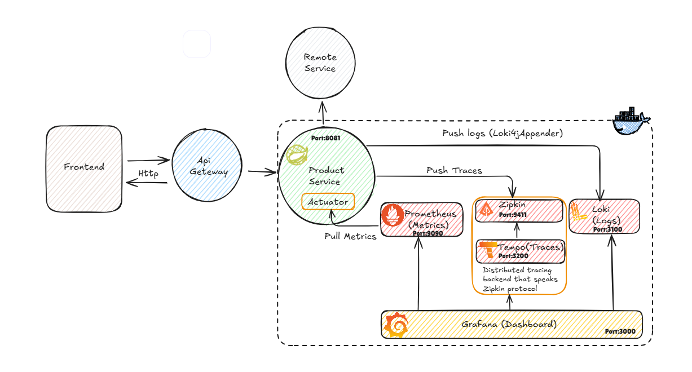

# Observability Demo Project

A **Spring Boot 3** microservice instrumented with Micrometer to showcase modern observability using **Prometheus**, **Grafana**, **Tempo** (tracing) and **Loki** (logging) – all orchestrated locally with **Docker Compose**.



> Java 21 • Spring Boot 3.5 • Micrometer • Prometheus • Grafana • Tempo • Loki

---

## Contents

- [Features](#features)
- [Prerequisites](#prerequisites)
- [Quick start](#quick-start)
- [Application End-points](#application-end-points)
- [Observability](#observability)
  - [Metrics](#metrics)
  - [Tracing](#tracing)
  - [Logging](#logging)
- [Building from source](#building-from-source)
- [Project Structure](#project-structure)
- [Cleanup](#cleanup)
- [License](#license)

---

## Features

| Layer            | Technology                                     |
| ---------------- | ---------------------------------------------- |
| Service          | Spring Boot REST API (`/products`)              |
| Metrics          | Micrometer Prometheus registry                 |
| Distributed Traces | Micrometer Tracing + Brave \| exported to Tempo |
| Logs             | Logback appender → Loki                        |
| Visualization    | Grafana dashboards (pregenerated datasource)   |
| Packaging        | Dockerfile + Docker Compose                    |

---

## Prerequisites

- **Java 21** (only if you want to run the service outside Docker)
- **Maven 3.9+** (for building)
- **Docker 20.10+** and **Docker Compose v2**

---

## Quick start

Spin up the whole stack (service + observability tools) in one command:

```bash
# inside the project root
docker compose up -d --build
```

Components will be available once the containers are healthy:

| Component   | URL                                    | Credentials |
| ----------- | -------------------------------------- | ----------- |
| Product API | <http://localhost:8081/products>        | —           |
| Prometheus  | <http://localhost:9090>                | —           |
| Grafana     | <http://localhost:3000>                | `admin` / `password` |
| Tempo       | <http://localhost:3200> (API)          | —           |
| Loki        | <http://localhost:3100> (API)          | —           |

Stop and remove containers with:

```bash
docker compose down -v
```

---

## Application End-points

| Path                          | Description                     |
| ----------------------------- | ------------------------------- |
| `/products` (GET/POST/DELETE) | CRUD operations on products     |
| `/actuator/health`           | Spring Boot health checks       |
| `/actuator/prometheus`       | Prometheus metrics scrape       |

---

## Observability

### Metrics

- Micrometer auto-collects JVM, HTTP server, database and custom metrics.
- Prometheus scrapes `/actuator/prometheus` every **5 seconds** (see `docker/prometheus/prometheus.yml`).
- Visualize in Grafana → *[Micrometer / Spring Boot]* dashboard.

### Tracing

- `micrometer-tracing-bridge-brave` instruments the application.
- Spans are exported via Zipkin protocol to **Tempo** (`http://my-tempo:9411`).
- Inspect traces in Grafana → *Tempo* data-source.

### Logging

- `loki-logback-appender` pushes structured JSON logs to **Loki**.
- Query logs in Grafana → *Loki* data-source.

---

## Building from source

Run the service locally (without Docker Compose):

```bash
# compile & run
docker compose up -d my-prometheus my-tempo my-loki my-grafana # optional – run only the observability stack

mvn spring-boot:run
```

Or build a jar / image:

```bash
mvn clean package -DskipTests
# Jar is in target/Observability-0.0.1-SNAPSHOT.jar

# Build container image
docker build -t product-service .
```

---

## Project Structure

```
Observability/
├── Dockerfile                 # Container for the product service
├── docker-compose.yml         # One-shot stack definition
├── docker/
│   ├── grafana/
│   │   └── datasource.yml     # Preconfigured datasources
│   ├── prometheus/
│   │   └── prometheus.yml     # Prometheus scrape config
│   └── tempo/                 # Tempo config & data
├── src/main/java/...          # Spring Boot source code
├── src/main/resources/
│   └── application.properties # Micrometer & logging config
└── pom.xml                    # Maven build file
```

---

## Cleanup

```bash
docker compose down -v --remove-orphans
```

---

## License

This project is licensed under the **MIT License** – see [LICENSE](LICENSE) for details.
